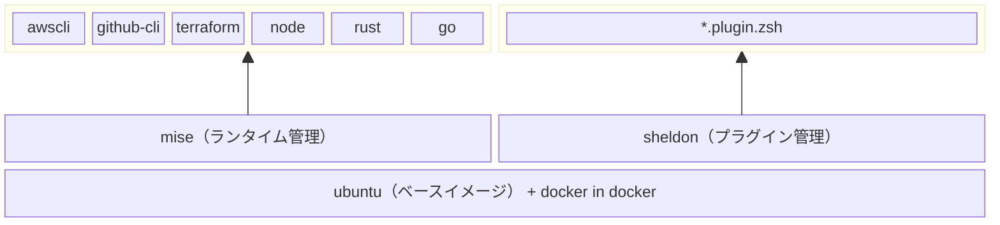

<h1 align="center">
    <br/>🐳 Hello Dev Container 🐳<br/><br/>
</h1>

## 💫　クイックスタート

**🌐 ブラウザ上で開発する場合**
    
[](https://codespaces.new/shinoda-yosuke-lvgs/hello-devcontainer?quickstart=1)

**💻 VSCodeで開発する場合**
    
<a href="https://vscode.dev/redirect?url=vscode://ms-vscode-remote.remote-containers/cloneInVolume?url=https://github.com/shinoda-yosuke-lvgs/hello-devcontainer"></a>

<details>
<summary>上記ボタンから開けない場合</summary>

```bash
git clone https://github.com/shinoda-yosuke-lvgs/hello-devcontainer hello-devcontainer && devcontainer open hello-devcontainer
```
</details>

## 📝 構成イメージ



## 🔰 説明書

- 起動した時点でmiseで管理されたコマンドが使えるようになっています
    - `aws --version`
    - `gh --version`
    - `terraform version`
    - `node --version`
    - `rustc --version`
    - `go version`
    - `docker version`
- 起動した時点で`tabキー`による補完がある程度機能します
