```mermaid
block-beta
  columns 2

  block:s1:1
    awscli githubcli["github-cli"] terraform node rust go
  end
    
  block:s2:1
    zshplugins["*.plugin.zsh"]
  end

  space:2

  mise["mise（ランタイム管ç†ï¼‰"]:1
  sheldon["sheldon（プラグイン管ç†ï¼‰"]:1
  ubuntu["ubuntu（ベースイメージ） + docker in docker"]:2

  mise --> s1
  sheldon --> s2
```

<h1 align="center">
    <br/>🐳 Hello Dev Container 🐳<br/><br/>
</h1>

## 💫　クイックスタート

<div align="center">

**↓ ブラウザ上で開発する場合 ↓**
    
[](https://codespaces.new/shinoda-yosuke-lvgs/hello-devcontainer?quickstart=1)

**↓ VSCodeで開発する場合 ↓**
    
<a href="https://vscode.dev/redirect?url=vscode://ms-vscode-remote.remote-containers/cloneInVolume?url=https://github.com/shinoda-yosuke-lvgs/hello-devcontainer"></a>

</div>
<br>

<details>
<summary>上記ボタンから開けなかった場合</summary>

```bash
git clone https://github.com/shinoda-yosuke-lvgs/hello-devcontainer hello-devcontainer && devcontainer open hello-devcontainer
```
</details>

<br>

## 📝 構成イメージ



## 🔰 説明書

- `mise`で管理されたコマンドはすぐに使えます
    - `aws --version`
    - `gh --version`
    - `terraform version`
    - `node --version`
    - `rustc --version`
    - `go version`
    - `docker version`
- `tabキー`による補完がある程度機能します
- `examples`ディレクトリに各言語の動作確認用のサンプルがあります
    - [docker](./examples/docker/README.md)
    - [go](./examples/go/README.md)
    - [node](./examples/node/README.md)
    - [rust](./examples/rust/README.md)
